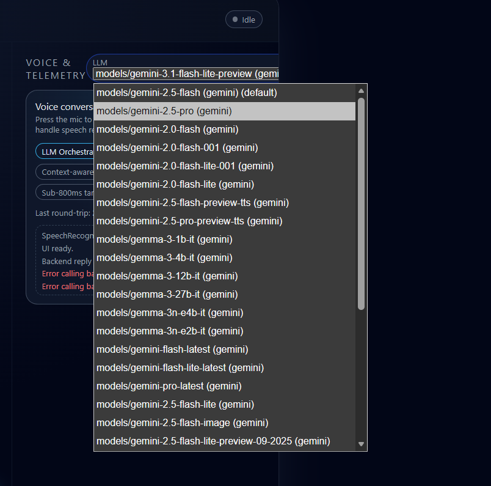
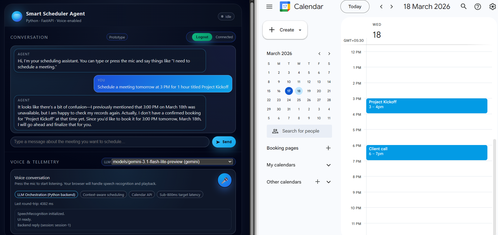
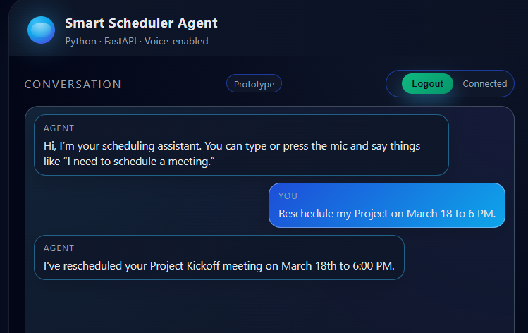
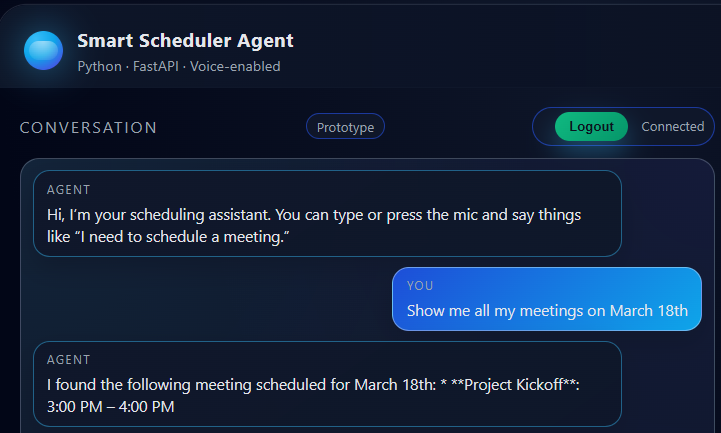

# 🤖 AI Calendar Assistant

An intelligent, conversational AI assistant that seamlessly integrates with your Google Calendar to schedule, reschedule, and manage your meetings using natural language.

---

## ✨ Features

- **Natural Language Processing**: Understands and processes commands in plain English.
- **Full Calendar Control**:
  - **Schedule**: Create new events with specified duration, time, and title.
    - **Relativity**: Can book relative to another event.
  - **Reschedule**: Flexibly move meetings to a particular time, date, or before/after/between other events.
  - **Find**: Query your calendar for existing meetings.
  - **Cancel**: Delete events from your calendar.
- **Conflict Detection**: Automatically checks your availability to prevent double-booking.
- **Timezone Aware**: Schedules events accurately based on your local timezone.
- **Stateful Conversations**: Remembers the context of your conversation for a smooth, multi-step scheduling experience.
- **Multi-Model Support**: Powered by leading AI models with context carryover.
- **Voice support**: Supports low latency TTS and STT. 

---

## 🚀 Getting Started

### Prerequisites

- [Python 3.12+](https://www.python.org/downloads/)
- A Google Cloud Platform (GCP) project
- [Railway Account](https://railway.app/) (for deployment)

### 🛠️ Google Cloud Setup

1.  **Create a GCP Project**:
    - Go to the [Google Cloud Console](https://console.cloud.google.com/) and create a new project.

2.  **Enable the Google Calendar API**:
    - In your project, navigate to **APIs & Services → Library**.
    - Search for "Google Calendar API" and enable it.

3.  **Create a Service Account**:
    - Go to **APIs & Services → Credentials**.
    - Click **Create Credentials → Service Account**.
    - Give it a name, grant it the "Owner" role for simplicity (or more restricted roles for production), and click **Done**.
    - Open the service account, go to the **Keys** tab, click **Add Key → Create new key**, select **JSON**, and download the key file.

4.  **Create OAuth 2.0 Credentials**:
    - Go to **APIs & Services → Credentials**.
    - Click **Create Credentials → OAuth client ID**.
    - Select **Web application** for the application type.
    - Add the following **Authorized redirect URIs**:
      - For Railway deployment: `https://<your-railway-public-domain>/api/oauth2callback`
      - For local development: `http://localhost:8000/api/oauth2callback`
    - Click **Create** and download the JSON file.

### ⚙️ Environment Variables

Set the following environment variables in your `.env` file for local development or in Railway for deployment.

| Variable                         | Description                                                                  |
| -------------------------------- | ---------------------------------------------------------------------------- |
| `GOOGLE_APPLICATION_CREDENTIALS` | The JSON content of your **service account key**.                            |
| `GOOGLE_OAUTH_CLIENT_SECRETS`    | The JSON content of your **OAuth 2.0 client ID**.                              |
| `CALENDAR_ID`                    | The ID of the calendar to manage. Use `primary` for your main calendar.      |
| `GEMINI_API_KEY`                 | Your API key for the Gemini model.                                           |

### 📦 Installation & Local Development

1.  **Clone the repository**:
    ```bash
    git clone <your-repository-url>
    cd scheduler_bot
    ```

2.  **Install dependencies**:
    ```bash
    pip install -r requirements.txt
    ```

3.  **Run the application**:
    ```bash
    python main.py
    ```
    The API server will start at `http://localhost:8000`.

---

## Demo Video
[](https://youtu.be/VlrUC5KTXQ8)

---

## 💬 Example Conversations

### Multi-Model Support
Allows user to switch between models of their choice, context is carried over and not refreshed upon switching models.
A stub/test bot kept for testing purposes to conserve API usage during development. 




#### 🗓️ Schedule a Meeting
> **User**: "Schedule a meeting tomorrow at 3 PM for 1 hour titled 'Project Kickoff'."
>
> **Assistant**: "Done! I've scheduled 'Project Kickoff' for tomorrow at 3 PM."



This can also be done relative to another meeting:

> **User**: "Schedule a meeting, dscuss, after client call for a duration of 2 hours."
>
> **Assistant**: "I have an avilability at 5:30 PM for scheduling the 'discuss' meeting. Shall I confirm with the booking?"
>
>**User**: "Please do."
>
>**Assistant**: "'discuss' has been successfully schedule from 5:30 PM to 7:30 PM. on March 18"


#### 🔄 Reschedule a Meeting
> **User**: "Reschedule my Project on March 18 to 6 PM."
>
> **Assistant**: "Your meeting has been rescheduled to 6 PM."




#### 🔍 Find Meetings
> **User**: "Show me my meetings for tomorrow."
>
> **Assistant**: "You have 'Project Kickoff' at 6 PM and 'Client Call' at 5 PM."




#### ❌ Cancel a Meeting
> **User**: "Cancel my marketing meeting tomorrow."
>
> **Assistant**: "The meeting 'Marketing Sync' has been cancelled."


---

## 🔌 API Endpoints

### Converse with the Assistant

Handles all conversational interactions for scheduling.

**Endpoint**: `POST /api/converse`

**Request Body**:
```json
{
  "message": "Schedule a meeting tomorrow at 3 PM",
  "session_id": "session-123",
  "model": "models/gemini-2.5-flash",
  "timezone": "America/New_York"
}
```

**Example Response**:
```json
{
  "reply": "I've scheduled a meeting for you tomorrow at 3 PM. What should it be called?",
  "session_id": "session-123"
}
```

**Endpoint**: `POST /api/models`

**Example Response**:
```json
{
    "default_model": "models/gemini-2.5-flash",
    "gemini": ["models/gemini-2.5-flash","models/gemini-2.0-pro", "..."],
    "dumbbot": ["dumbbot"],
}
```


**Endpoint**: `POST /api/auth_url`

```json
{
    "auth_url": "https://schedulerbot-production.up.railway.app/api/oauth2callback",
    "session_id": "session-1"
}
```


**Endpoint**: `POST /api/logout`

**Example Response**:
```json
{
    "message": "Logged out successfully"
}
```

**Endpoint**: `POST /api/oauth2callback`

**Example Response**:
RedirectResponse("https://schedulerbot-production.up.railway.app/api/oauth2callback/?session_id={session_id}&connected=1")


---

## 🏛️ Architecture

The application follows a modular architecture that separates concerns for clarity and maintainability.

```
User
 ↓
FastAPI Web Server (`main.py`)
 ↓
LLM Client (`llm_client.py`)
 ↓
Conversation Manager (`conversation.py`)
 ↓
Calendar Service (`calendar_service.py`)
 ↓
Google OAuth & API (`google_oauth.py`, `googleapiclient`)
```

---

## 📂 Project Structure

```
scheduler_bot/
│
├── main.py                # FastAPI application, handles API routes
├── conversation.py        # Manages conversation state and logic
├── calendar_service.py    # Interfaces with the Google Calendar API
├── google_oauth.py        # Handles Google OAuth2 flow
├── llm_client.py          # Interfaces with the language model
│
├── static/                # Contains frontend files
│   ├── index.html         # Main HTML file
│   ├── app.js             # JavaScript for the frontend
│   └── styles.css         # CSS for styling
│
├── requirements.txt       # Project dependencies
├── Procfile               # App startup process for Railway
└── Readme.md              # You are here!
```

---

## 🔮 Future Enhancements

While the assistant is highly functional, here are some potential improvements for the future:

### Multi-User Support
- **User Authentication**: Implement a secure authentication system to manage individual user accounts.
- **Isolated Sessions**: Ensure that each user has a private and separate conversation state.

### Multi-Action Support
- Ensuring that agent can understand, seggregate, and perform multiple actions in a single sentence.

### Persistent State Management
- **Database Integration**: Replace the current in-memory session store with a persistent database like Redis or a SQL database (e.g., PostgreSQL).
- **Benefits**:
  - **Scalability**: A database would allow the application to handle a larger number of users and sessions.
  - **Robustness**: Conversation state would be preserved across server restarts and deployments.

---

## 🤝 Contributing

Contributions are welcome! Please feel free to submit a pull request or open an issue for any bugs or feature requests.

---

## 📄 License

This project is licensed under the MIT License. See the `LICENSE` file for details.

